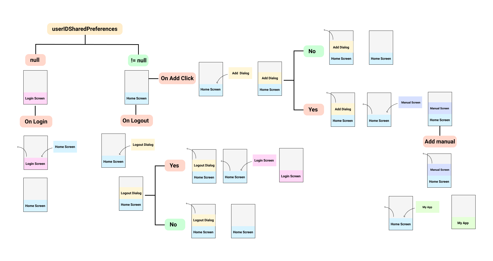

# CGPA Calculator App
### CGPA Calculator is mainly aimed at enabling BITS’ians to calculate and journalise their grades achieved in different semesters with the feature of calculating their SGPA and CGPA. 
### The calculation is automatic and without any hassle. Just add the course you are pursuing in a semester, the course title is automatically detected. Add credits of that course and your grade achieved to add that course for SGPA and CGPA calculation. You can plug and play with the courses anytime you want. 
#### CGPA Calculator App is developed using Flutter. Authentication is performed using Firebase and the data of the user is stored inside the phone storage itself using persistent data storage SQFlite package called Moor. 
- - - -
### Created and Maintained by 
#### Sai Ankit ( [Code Studio Sai Ankit](https://www.youtube.com/c/CodeStudioSaiAnkit?sub_confirmation=1) ) 

