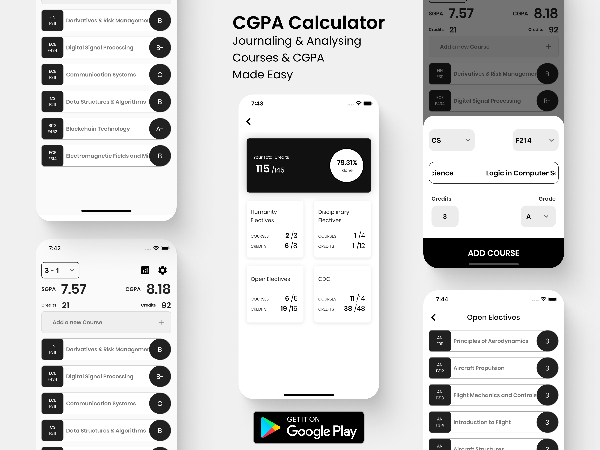
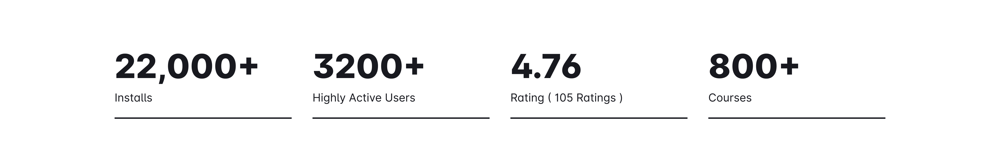
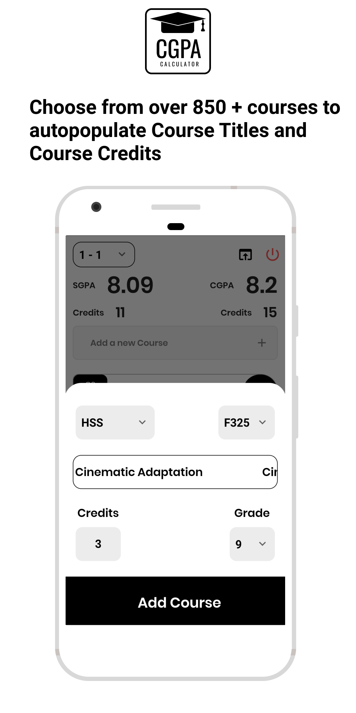
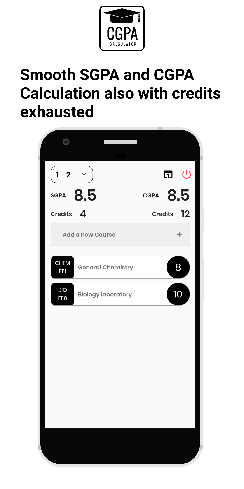
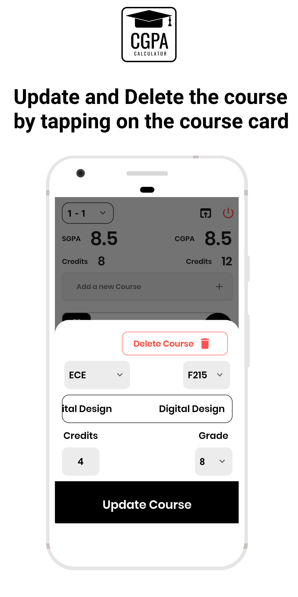
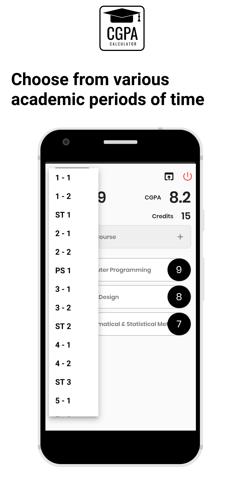
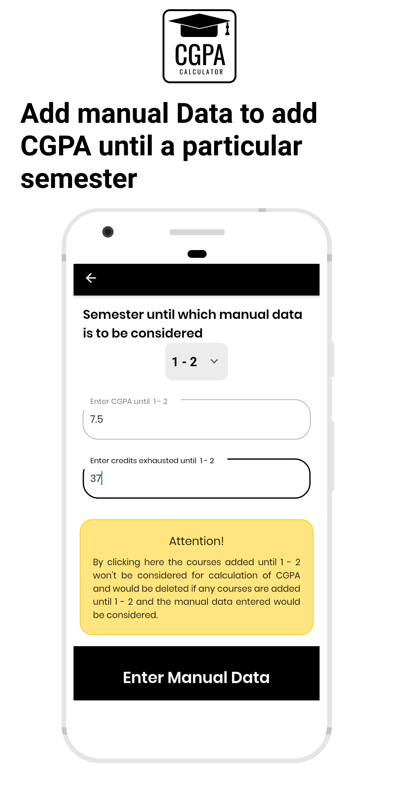
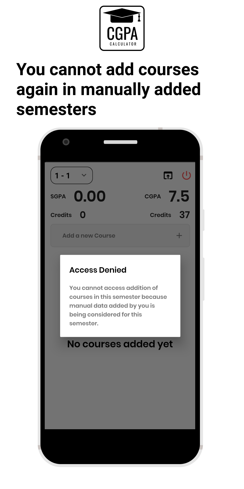

## CGPA Calculator
Journaling and Analysing Courses and CGPA Made Easy




#### Introduction

CGPA Calculator is mainly aimed at enabling BITS’ians to calculate and journalise their grades achieved in different semesters with the feature of calculating their SGPA and CGPA.

<br/>
The calculation is automatic and without any hassle. Just add the course you are pursuing in a semester, the course title is automatically detected. Add credits of that course and your grade achieved to add that course for SGPA and CGPA calculation. You can plug and play with the courses anytime you want.
<br/>
CGPA Calculator App is developed using Flutter. Authentication is performed using Firebase and the data of the user is stored inside the phone storage itself using persistent data storage SQFlite package called Moor.

<br/>

##### This app is published at https://play.google.com/store/apps/details?id=com.saiankit.cgpacalculator

------

#### Salient Features of CGPA Calculator

###### Video Version : https://youtu.be/fHrFlq0kOGY

###### Photographic Version :


|  |  |  |  |
| ----------------------------------------------------- | ----------------------------------------------------- | ----------------------------------------------------- | ----------------------------------------------------- |
|  |  |  |  |

------


#### How to use the app locally on your machine ?

<u>Requirements</u>

1. Flutter installed on your machine.
2. A simulator/emulator for running the application.

**Step #1** : Clone this repository using

``` git clone https://github.com/saiankit/CgpaCalculator.git ```

**Step #2** : Run the following command in the directory

``` flutter packages get```

**Step #3**: Open a simulator / emulator and run the application

``` flutter run```

- - - -

### Designed and Developed by
#### Sai Ankit ( [Code Studio](https://www.youtube.com/c/CodeStudioSaiAnkit?sub_confirmation=1) )
